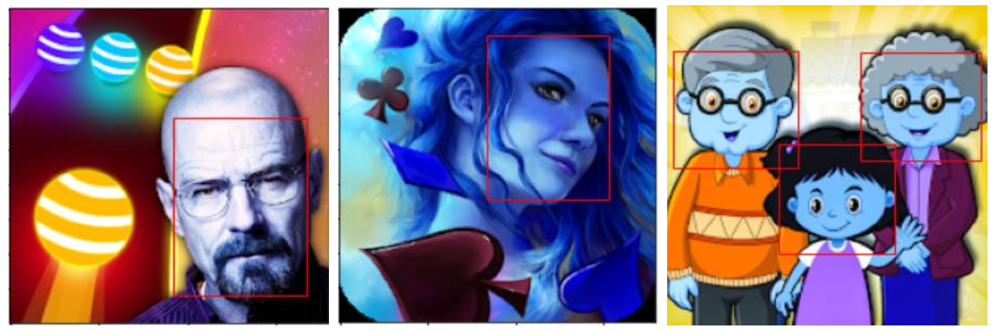
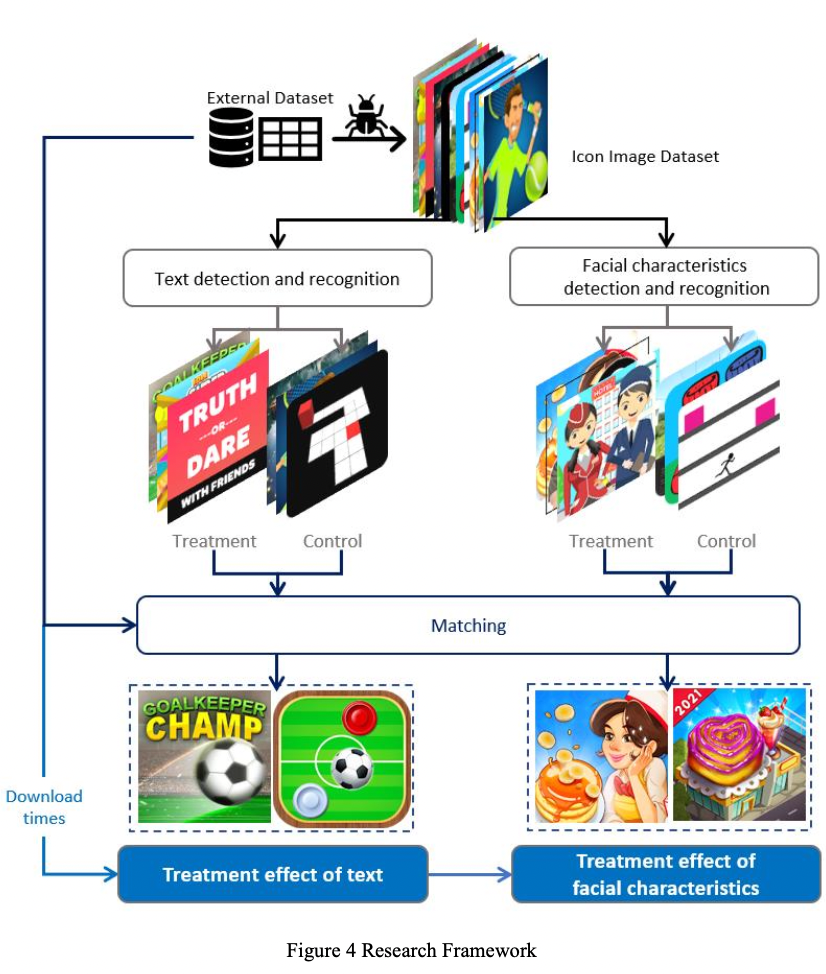
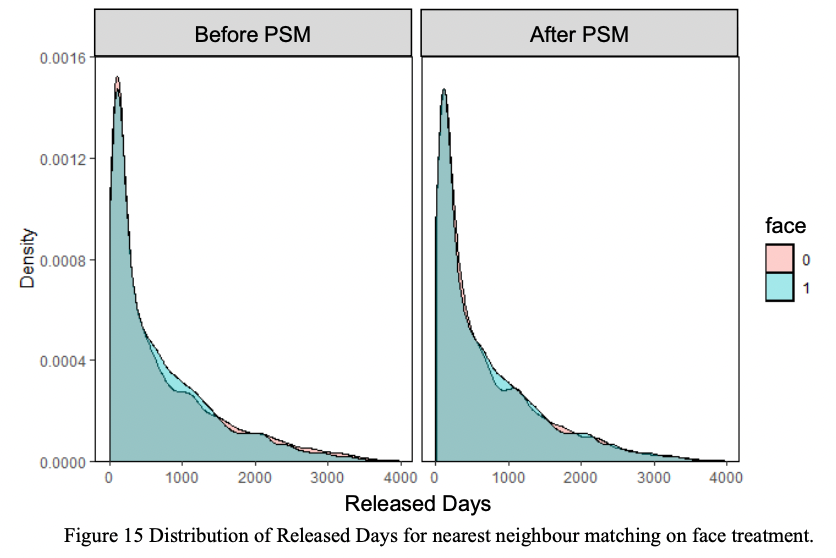

# App-icon
Whether facial experssions and text on app icons impact dowload times? A causal inference analysis
 
This project use tesseract, mask r-cnn, propensity score matching to study how visual elements on app icons

- Preprocessing & Download images: EDA analysis of Dataset, Feature engineering, Download of icon images
- Tesseract: Extract text elements from images
- Face Recognition: Extract face elements from images 
